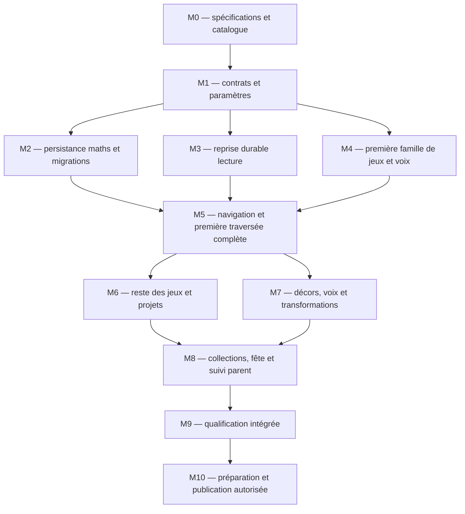

# La Vallée des Nombres — plan de réalisation

Date : 27 septembre 2026. Statut : six lieux, 18 familles, 18 projets et fête intégrés ; qualification suspendue à la demande du parent pour aujourd'hui.
Le parent a validé le gameplay et demandé un plan complet, réalisé ensuite par l'orchestrateur
et des sous-agents dont le modèle et l'effort sont adaptés au travail et à son coût.
Son accord « très bien, vas-y » après remise du plan autorise désormais l'implantation.
Le parent autorise ensuite le générateur d'images intégré de Codex pour les nouveaux médias.
Les contenus produits restent en brouillon jusqu'au visa ; les verrous existants restent conservés.

**Arbitrage du 26 septembre après écoute :** décor des Ponts validé et intégré. Voix refusées
pour silences excessifs et manque de fluidité ; le parent demande de finir le reste du jeu et de
reprendre les voix plus tard. Les travaux audio de M4/M7 et leur visa restent donc explicitement
reportés. Cette exception ne retire aucune autre exigence de jeu, persistance ou vérification.

Contrats : [spécifications](specifications-vallee-des-nombres.md),
[catalogue des jeux](catalogue-jeux-mathematiques.md), [AGENTS](../AGENTS.md).
La [file active](etat-courant-et-file.md) conserve seule les états courants et les autres demandes.
Ce plan contient le découpage et ses preuves, pas un second journal d'avancement.

## 1. Périmètre ferme et responsabilités

La livraison cible comporte les six lieux, 18 familles, 18 projets et la fête, avec accès permanent,
génération hors ligne, reprises lecture/maths, récompenses séparées, sauvegarde et
suivi parent. L’audio complet est reporté par l’arbitrage ci-dessus. Les petits lots ci-dessous servent à éprouver la conception avant de la généraliser.
Une tranche interne ne peut pas être présentée comme la région terminée.

L'orchestrateur est responsable du résultat intégré, des interfaces communes, des décisions,
des rapports, de la file cumulative et du jeton de compilation/campagne. Un sous-agent reçoit
un lot précis et une liste exclusive de fichiers. Les agents signalent une dépendance avant
de modifier un fichier possédé par un autre ; les ajustements communs reviennent à l'orchestrateur.

Les chemins annoncés comme « nouveaux » sont ceux du plan initial. Les chemins de code et
schémas implantés sont présents ; les brouillons audio reportés ne le sont pas. La migration
maths a pris le numéro `013` ; `014` conserve les préférences de niveau.

## 2. Constats qui déterminent l'ordre

| Constat vérifié dans le dépôt | Conséquence sur le plan |
|---|---|
| `partage/src/identifiants.ts`, `contenu/monde/regions.json` : six régions phonologiques | Destination maths indépendante, sans septième `CodeRegion` |
| `client/src/monde/carte/modele.ts`, `CarteMonde.tsx` : ancres liées au chemin lecture et à la Pierre | Prise nord distincte ; mesurer masque et cible sur le décor final |
| `partage/src/base/depots/tentatives.ts` : journal et cascade lecture dans la même transaction | Service et journal maths séparés ; preuve de delta lecture nul |
| `client/src/etat/profil-memorise.ts`, `magasin.ts`, `routeur.tsx` : exercice lecture seulement en mémoire | Lot M3 explicite pour reprise durable des 14 moteurs, avant promesse de bascule complète |
| `partage/src/base/services/reinitialisation-profil.ts` : purge des tables portant `profil_id` | Classifier les tables et définir les portées avant d'ajouter des données maths |
| `client/src/base/sqlite-wasm.worker.ts` : import limité à la version 12 et verrou exclusif | Migration/import à étendre ensemble ; conserver le refus du second onglet PWA |
| `client/src/api/contrat.ts`, `port-local.ts`, `port-http.ts` | Parité obligatoire des services local/HTTP ; pas de fonction maths limitée au LAN |
| `partage/src/voix/manifeste.ts`, `production/voix.lock.json` : voix préproduites | Inventaire fermé des nombres/segments et grammaire audio avant généralisation |

La séparation en deux journaux ne change pas la vérité des anciens résultats : `tentatives`
reste souverain pour la lecture, `tentatives_maths` l'est pour les maths. Chaque projection
provient de son journal. L'espace parent réunit des vues, pas les cascades pédagogiques.

## 3. Dépendances et moments d'intégration

Ce graphe décrit les dépendances, pas une permission de lancer toutes ses branches à la fois.
M2 et M3 touchent des interfaces de persistance communes : leur gel est séquentiel ; une fois
le contrat posé, les adaptateurs de moteurs lecture et les scènes maths sont indépendants.
M6 et M7 peuvent avancer ensemble sur logique/contenu et assets déclarés, un propriétaire par fichier.

La première tranche est **MAT-PON-P01 — La première traversée**, avec MAT-PON-01/02/03 :
mesurer, assembler une longueur par plusieurs solutions, placer le pont sur la rive. Elle couvre
des gestes distincts, une quantité transmise entre étapes, un cadeau, une reprise et un retour
à la lecture. Le décor des Ponts a reçu le visa du parent. La preuve audio attend la reprise des voix.

### Ordre de travail à suivre

| Vague | Travail prêt à démarrer | Organisation et point de passage |
|---|---|---|
| A | M1 : contrats, paramètres des trois ponts et inventaire audio | Un agent Sol élevé ; revue de l'orchestrateur. Les ports, états, données de projet et règles de validation sont gelés avant leurs consommateurs. |
| B | M2 : transaction/migration ; M3 : état des moteurs ; M4 : règles des ponts | Au plus trois lots indépendants : Sol élevé pour les données, Sol élevé pour la reprise, Sol élevé pour générateurs/validateurs. L'orchestrateur possède les ports, la composition et les fichiers communs. Aucun autre agent SQL. |
| C | M4 scènes et M5 intégration | Terra moyen reçoit les scènes définies ; l'orchestrateur raccorde navigation, services et sauvegardes. Première traversée complète, puis revue du geste, des voix et du décor. |
| D | M6 familles restantes et M7 médias | Deux lots disjoints à la fois après acceptation de la tranche : un lieu de jeux, un lot de médias. Les composants partagés restent à leur propriétaire. |
| E | M8 collections/fête/parent | Terra moyen sur interfaces fixées ; revue Sol élevé des gains, exports et resets. |
| F | M9 puis M10 | Gel du livrable, recette intégrée, préparation ; publication après accord sur ce résultat concret. |

Le chemin critique est A → B → C → D → E → F. Un agent ne prend un lot que lorsque ses
entrées et sa liste de fichiers sont disponibles. Les estimations de durée/coût seront fondées
sur la première traversée mesurée ; aucun délai global n'est déduit du nombre de familles.

Pour suivre l'exécution, utiliser les cases de chaque lot et reporter seulement son statut actif,
le prochain résultat et les blocages réels dans la file. Une tâche commencée ou un test ciblé vert
ne suffit pas à cocher le résultat d'un lot.

**Lecture des cases au 27 septembre :** une case cochée atteste un élément présent dans le code
ou un contrôle ciblé indiqué ci-dessous. Elle ne vaut ni visa humain, ni recette PWA, ni campagne
finale. Les voix sont reportées par le parent. Les cinq autres lieux ont un décor SVG fonctionnel ;
leurs remplaçants peints sont générés, présentés et gardés en brouillon jusqu'au visa esthétique.
Les trois nouvelles références de carte attendent aussi leur visa. M9 et M10 restent ouverts.

## 4. Lots exécutables

### M0 — Préparer le dossier de conception

Résultat : spécifications, catalogue, plan et entrée dans la file active. Le gameplay approuvé,
les décisions détaillées, les paramètres proposés et les validations futures sont distingués.

- [x] Relire les 20 exigences VN, les 18 familles et les 18 projets ; aucun identifiant orphelin.
- [x] Contrôler liens relatifs, encodage, exemples, cohérence des niveaux et conservation des règles.
- [x] Remettre au parent les documents et nommer les limites ; aucun changement du jeu intégré.

Fichiers : les trois documents de ce dossier et `Docs/etat-courant-et-file.md`.
Exclusions : les quatre originaux, le référentiel, les assets, les sauvegardes et le code.
Preuve : relecture documentaire, liens vérifiés et diff limité à ces fichiers.
Un prototype commencé par anticipation a été sorti du code actif et conservé dans
`bac-a-sable/vallee-prototype-non-integre-2026-09-26/`. Il ne valide aucun lot M1–M10 ; sa
réutilisation éventuelle exige une revue du contrat et du diff courant. Les essais ciblés déjà
effectués sur ce prototype ne sont pas une qualification de la conception ni du jeu.

### M1 — Fixer les contrats communs et les paramètres de contenu

Résultat : types et schémas assez précis pour répartir les fichiers sans laisser un exécutant
inventer les règles pédagogiques. Sol élevé, revue de l'orchestrateur.

- [x] Créer les types sous `partage/src/mathematiques/` : famille, niveau, instance versionnée,
  état, geste, réponse, tentative, projet, récompense et bilan parent.
- [x] Définir les transitions autorisées : créer, reprendre, manipuler, valider, mettre en pause,
  changer de famille/niveau, terminer, rejouer ; préciser les révisions et clés idempotentes.
- [x] Définir séparément le contrat de reprise lecture, avec version de moteur et état sérialisable.
- [x] Déclarer les paramètres des 54 couples famille/niveau à partir du catalogue ; unités,
  ressources, cas exclus, solutions multiples, aides, secours et signatures de répétition.
- [x] Écrire les invariants de chaque famille et le modèle de transmission des variables de projet.
- [x] Fixer l'identité de session de projet, sa version éditoriale, les variables déjà montrées,
  l'ordre et la complétion des étapes ainsi que la clé/type du cadeau. Leur conservation doit
  permettre de reconstruire les gains même après changement du catalogue.
- [x] Déclarer les combinaisons de difficultés compatibles ; pour PON-P01, vérifier les 21
  combinaisons du catalogue et le parcours de choix explicite des six incompatibles.
- [ ] Préparer les codes maths et leur relation aux observations dans `contenu/brouillons/mathematiques/`.
  Présenter l'extension exacte du référentiel protégé avant sa modification, sans toucher aux codes lecture.
- [x] Fixer les schémas des modèles et de leurs instances ; documenter versions supportées et compatibilité.
- [x] Fixer signatures de `PortApi`, réponses HTTP et erreurs ; distinguer conflit, absence,
  défaut de stockage, instance incompatible et requête invalide.
- [ ] Produire un premier inventaire audio : phrases fixes, nombres, unités, accords, durées,
  fractions, aides et raccords ; calculer les médias requis pour chaque famille/niveau.
- [x] Distinguer instance distribuée, solution témoin réservée aux vérifications et validateur
  indépendant ; aucune réponse témoin utilisée comme simple comparaison dans la scène.
- [x] Préparer la liste explicite des brouillons à livrer : `contenu/brouillons/*` est ignoré par
  Git. Un futur ajout ciblé doit conserver cette protection pour les autres brouillons.

Nouveaux chemins proposés : `partage/src/mathematiques/`,
`contenu/brouillons/mathematiques/`, `contenu/schemas/mathematiques/`.
Intégrations : `partage/src/api/contrats.ts`, `client/src/api/contrat.ts`,
`partage/src/testabilite/surface.ts`, `contenu/referentiel/competences.json` après validation.
Exclusions : pas de BKT maths, seuil de maîtrise, texte libre généré ou dépendance ajoutée implicitement.
Preuve : exemples typés bons/mauvais, solutions alternatives, contrats relus et domaines fermés.

### M2 — Conserver les instances, les tentatives et les deux domaines

Résultat : journal maths, projections et reprise robustes, dans la même base que le profil.
Sol élevé pour migration/transactions ; pas de division du lot entre plusieurs écrivains SQL.

- [x] Ajouter une nouvelle migration : instances, gestes, reprise, tentatives et projections maths ;
  générations séparées, contraintes d'unicité, références et index nécessaires.
- [x] Réserver dans cette migration la reprise lecture de M3 : profil, génération lecture,
  révision, version du contrat/moteur et instantané. Le lot M3 consomme ce schéma sans le modifier.
- [x] Exposer les deux générations dans les contrats, création/lecture du profil et ports ; vérifier
  la génération avant toute recherche d'un ancien accusé idempotent, y compris après reset.
- [x] Persister l'instance avant affichage, puis chaque geste terminé avec révision et clé unique.
- [x] Valider les réponses côté service partagé depuis l'instance stockée ; enregistrer tentative,
  avancement et cadeau dans une seule transaction. Célébrer après accusé durable.
- [x] Traiter réémission, double tap, clé réutilisée avec autre contenu, fermeture et conflit LAN.
- [x] Séparer les gains maths et lecture ; reconstruire les projections depuis leurs journaux.
- [x] Classifier les tables pour les portées lecture/maths/toute progression/complète. Échouer
  sur une table non classifiée ; vérifier générations et messages parent de ces portées.
- [x] Contrôler cette classification dès la prévisualisation ; respecter les clés étrangères
  dans l'ordre de suppression et le décompte des cascades. Toute anomalie laisse la base intacte.
- [x] Étendre les ports local/HTTP et les routes maths, sans emprunter le dépôt de tentatives lecture.
- [x] Étendre limite de version, tables obligatoires et transactions d'import du worker autonome.
- [x] Geler toutes les écritures différées à l'import ; exporter l'état durable des deux domaines.
- [x] Définir une barrière commune pour écritures maths, reprise lecture et tentatives lecture :
  suspendre les producteurs, vider les files ou refuser explicitement l'opération, vérifier la
  base candidate, permuter puis rouvrir. Un export ne prétend pas contenir un geste non acquitté.
- [ ] Vérifier l'import d'une v12, d'une nouvelle version, d'une base corrompue et trop récente ;
  conserver la base d'origine si l'import échoue.

Existants : `partage/src/base/`, `serveur/migrations/`, `serveur/src/routes/`,
`client/src/api/`, `client/src/base/sqlite-wasm.worker.ts`,
`client/src/base/migrations-autonome.ts`, `client/src/pwa/sauvegarde-locale.ts`,
`partage/src/parent/reinitialisation.ts`.
Raccords de génération et de files : `partage/src/api/contrats.ts`,
`partage/src/base/depots/profils.ts`, `serveur/src/routes/profils.ts`,
`client/src/api/client.ts`, `client/src/api/tentatives-en-attente.ts`.
Nouveaux : `serveur/migrations/013_vallee-des-nombres.sql`, `014_preferences-niveaux-maths.sql`,
`serveur/src/routes/mathematiques.ts`, dépôts/services maths dédiés.
Preuve : tests API/base, crash aux frontières de transaction, deux instances SQLite,
parité ports et deltas lecture exactement nuls. Un test de reset utilise une fixture synthétique.

### M3 — Rendre la reprise lecture durable

Résultat : changer de mode et fermer l'application conserve aussi le nœud de lecture commencé.
Ce résultat n'existe pas aujourd'hui. Sol élevé définit le contrat ; Terra moyen peut prendre
les adaptateurs simples une fois ce contrat gelé et leurs fichiers distribués.

- [x] Inventorier l'état utile des 14 moteurs : paquet/version, graine, objets/actions,
  aide, erreurs, rang de sortie, temps actif et choix nécessaires à la reprise.
- [x] Inclure les tirages actuellement détenus par les composants `attrape` et `place` : ordre
  des cibles et mélange de réserve. Restaurer ces dispositions sans nouveau tirage au montage.
- [x] Définir un codec qui refuse les états non sérialisables au lieu de les perdre silencieusement ;
  versionner les moteurs dont l'état change et prévoir la lecture des anciennes versions livrées.
- [x] Écrire les instantanés/actions dans SQLite, avec profil/génération/révision et contrat versionné.
- [x] Recharger le plan de sortie et le moteur après démarrage ; résoudre `/noeud` depuis cette reprise.
- [x] Suspendre les temporisations et l'audio pendant les maths ; l'absence ne compte pas comme hésitation.
- [x] Reprendre un état sémantiquement identique sans relancer un ancien effet externe ou une validation.
- [x] Préserver la file de tentatives déjà terminées et la génération du profil à chaque transition.
- [x] Vérifier reprise pour chaque moteur : `assemble`, `attrape`, `chemin`, `chrono`, `colorie`,
  `eclair`, `grave`, `histoire`, `libre`, `paires`, `phrase`, `place`, `trace`, `tri`.
- [x] Prévoir le cas d'un ancien paquet/version lors d'une mise à jour ; aucun crédit de remplacement.

Existants : `client/src/etat/magasin.ts`, `profil-memorise.ts`, `client/src/routeur.tsx`,
`client/src/ecrans/EcranNoeud.tsx`, `client/src/moteurs/`, `partage/src/moteurs/`,
services de sortie dans `partage/src/base/`, ports et migrations déjà réservés par M2.
M2 et M3 ne modifient pas ces interfaces communes simultanément ; l'orchestrateur réserve la migration.
Preuve : fermeture/rechargement et bascule pour les 14 moteurs ; même état utile et même futur résultat.
Limite admise : on ne conserve pas la frame d'animation, la position du pointeur ou le milieu d'un son.

### M4 — Construire les trois jeux de la première traversée

Résultat : MAT-PON-01/02/03 jouables avec du matériel exact, en toucher et au clavier.
Sol élevé pour générateurs et oracles ; Terra moyen pour les scènes après gel des contrats.

- [x] Implémenter règle virtuelle, bande graduée, pièces de longueur et échanges réversibles.
- [x] Produire les générateurs purs et les validateurs indépendants pour les trois familles.
- [x] Faire varier inconnue, disposition et solutions, en respectant les niveaux du catalogue.
- [x] Définir l'état initial de remplacement d'un module en Exploration ; vérifier fenêtre et
  bornes distinctes en MAT-PON-02, compositions distinctes en Défi et contre-exemples plausibles.
- [x] Ajouter validation explicite, annulation, écoute, indice et démonstration ; barème partagé.
- [x] Écrire les tests de bornes, aide, solution alternative et mauvaises réponses plausibles.
- [ ] Produire les voix fixes et variables de cette tranche et vérifier le raccord des segments.
- [x] Préparer un décor de ponts et ses transformations dans la direction artistique existante.
- [ ] Vérifier composant, geste réel, focus, polices, orientation et animations réduites.

Implantés : `partage/src/mathematiques/jeux/ponts/`,
`client/src/mathematiques/AteliersPonts.tsx` et `ateliers-ponts.css`.
Brouillons des trois familles et voix de MAT-PON-P01 : reportés avec le travail audio.
Exclusions : aucun écran scolaire générique imposé aux autres lieux, aucun moteur physique.
Preuve : règles mathématiques et jouabilité démontrées séparément sur instances fixes et générées.

### M5 — Intégrer une tranche complète avant généralisation

Résultat : profil neuf → vallée → MAT-PON-P01 → cadeau → lecture → fermeture → reprises exactes.
L'orchestrateur porte l'intégration ; Sol moyen peut posséder les écrans/routes sur contrat fixé.

- [x] Ajouter destination nord indépendante, accès campement et écrans maths dans le routeur.
- [x] Afficher les deux reprises, ouvrir tous les lieux ; les prototypes internes sont clairement internes.
- [x] Relier le projet aux quantités conservées entre ses trois étapes et à la transformation réelle.
- [x] Afficher un résultat maths lié au journal, puis retrouver la scène transformée après relance.
- [ ] Obtenir l'échantillon cohérent pour visa : carte nord, scène jouée, effet final et écoute.
- [ ] Vérifier accès profil neuf/avancé/lecture terminée et Gobi seul/compagnon déjà acquis.
- [x] Jouer la même séquence par port HTTP et port local, fermer/rouvrir, exporter/importer,
  puis comparer journal maths, reprise, projet et cadeau. L'instantané lecture avant/après
  couvre tentatives, BKT, Leitner, cascade, Éclats, formes/stade Gobi et mots acquis.
- [ ] Exécuter la recette discriminante VN-01/02/04/05/07/10/11/12/15/16 sur cette tranche.
- [ ] Intégrer et lire une campagne complète de clôture de ce lot, selon l'annexe T ; consigner
  le livrable exact. Réutiliser la preuve seulement si ses entrées sont toujours identiques.

Existants : `client/src/monde/carte/CarteMonde.tsx`, `client/src/ecrans/EcranCarte.tsx`,
`EcranCampement.tsx`, `client/src/routeur.tsx`, `client/src/etat/`, API gelée.
Implantés : `client/src/mathematiques/EcranMathematiques.tsx`, `ChoixVallee.tsx`,
`DecorVallee.tsx` et `styles-mathematiques.css`.
Preuve de sortie : une mission convaincante, autonome et persistante, avec rapports et limites lus.
Une revue peut corriger la composition ou le geste ; elle ne remplace pas la qualification du reste.

### M6 — Étendre aux 18 familles et 18 projets

Résultat : catalogue complet implémenté sur les composants éprouvés, avec validateurs propres.
Un agent par lot disjoint ; Sol moyen pour nouveaux gestes, élevé pour oracles délicats.

- [x] Jardin : numération/échanges, parts d'un tout, tableaux et récoltes ; trois projets.
- [x] Moulin : groupes, partage, fractions ; trois projets, conservation des stocks et restes explicites.
- [x] Marché : valeur des pièces, rendu, choix sous budget ; trois projets, calcul entier en centimes.
- [x] Chantier : plans, cube/modèles de pliage, masses ; trois projets, géométrie logique exacte.
- [x] Horloge : cadrans, durées, tableaux ; trois projets, heure continue et contexte matin/soir.
- [x] Compléter les deux autres projets des ponts et leurs variantes.
- [x] Vérifier les 54 couples famille/niveau ; préparer un secours déterministe par couple
  et son dossier éditorial pour visa. Le registre essaie au plus douze graines avant ce secours.
- [x] Relier chaque projet à un modèle causal : variables entrantes, étapes, ressources et état final.
- [x] Couvrir choix libre, reprise, changement de niveau, anti-répétition et domaine trop petit.
- [x] Vérifier que toutes les familles restent accessibles sans compagnon ni projet préalable.

Les composants partagés (objets, segments, grilles, audio) ont un seul propriétaire. Demander une
évolution de contrat avant d'y ajouter une option ; pas de copie locale divergente.
Preuve : checklist du catalogue, tests propres aux nouvelles mécaniques, couverture réelle des routes.
Pas de campagne globale par famille ; tests ciblés, puis M9 sur l'ensemble intégré.

### M7 — Produire les décors, voix et réactions finales

Résultat : tous les contenus affichés à l'enfant sont approuvés, reconnus et disponibles hors ligne.
Terra moyen pour intégration définie ; production par procédures existantes, contrôle humain pour le visa.

- [x] Préparer un inventaire : extension nord de la carte, six décors de lieu, trois transformations
  par lieu, scène de fête, objets manipulés, six souvenirs, six objets campement, souvenir final.
- [x] Choisir calques et états combinables ; ne pas générer quatre images quasi identiques par défaut.
- [x] Conserver les silhouettes/voix des personnages ; produire seulement les poses réellement nécessaires.
- [x] Garder chiffres, graduations et quantités interactives en éléments exacts rendus par le code.
- [ ] Produire d'abord l'échantillon M5 ; appliquer les retours avant les lots de décors suivants.
- [ ] Produire textes et modèles dans les brouillons, avec contrôle lexical et traçabilité des validations.
- [ ] Fermer l'inventaire audio des niveaux livrés, produire les segments et contrôler l'écoute complète.
- [ ] Mettre à jour les manifestes/verrous par la procédure normale ; absence de fichier = modèle non publiable.
- [ ] Vérifier reconnaissance des objets, tailles, transparence, cadrage, superposition et prises tactiles.
- [ ] Préparer le jeu hors ligne et mesurer le poids des médias ; conserver les budgets de l'annexe T.

Procédures à lire lorsqu'elles deviennent nécessaires :
[générer un asset](../.agents/skills/generer-asset/SKILL.md),
[composer le campement](../.agents/skills/dessiner-campement/SKILL.md).
Les workflows, `production/style.txt` et la palette ne sont pas modifiés implicitement.
Preuve : fichiers servis réellement, inventaire complet, écoute et visa sur livrable identifié.

### M8 — Relier collections, fête et espace parent

Résultat : le monde maths a un aboutissement, les acquis restent visibles et l'adulte lit les faits.
Terra moyen sur interfaces fixées ; revue Sol élevé des attributions et portées de données.

- [x] Attribuer souvenir au projet 1, objet de campement au projet 3 de chaque lieu ; clés uniques.
- [x] Afficher les gains maths dans coffre/campement avec leur origine, sans modifier Éclats ou Gobi.
- [x] Réaliser la fête après les 18 projets, avec trois défis connus, Gobi seul possible et rejeu.
- [x] Ajouter filtre parent, historique, observations autonomes/aidées et conseil « travailler ceci ».
- [x] Ajouter export maths compréhensible (famille, niveau, instance/version, aide, erreurs, résultat),
  en distinguant le JSON d'analyse et la sauvegarde SQLite qui permet une reprise exacte.
- [ ] Relire les confirmations de reset/import ; vérifier chaque portée et les files anciennes.
- [ ] Vérifier les collections après import, recalcul, rejeu, changement de difficulté et remise à zéro ciblée.

Existants : `client/src/ecrans/EcranCoffre.tsx`, `EcranCampement.tsx`, `client/src/parent/`,
`partage/src/base/services/`, `partage/src/parent/`, PWA ; interfaces communes réservées.
Preuve : comparaison journal/projections/UI et deltas exacts sur les deux domaines.

### État des preuves avant M9

Le code expose les six lieux, les 18 familles à trois niveaux, les 18 projets de trois étapes
et `MAT-FET-P01`. Les projets 1 donnent chacun un souvenir, les projets 2 aucun cadeau et
les projets 3 un objet ; la fête donne le treizième gain distinct après les 18 projets. Les variables
transmises, l'ordre des étapes et les gains sont conservés dans la session. Aux Ponts, P02
mesure deux morceaux puis transmet leur somme ; P03 fait retirer le module abîmé par l'enfant,
garde le module stable et vérifie la portée réparée sur une graduation. Les domaines compatibles
sont explicités dans le catalogue.

La suite SQL couvre 54 couples famille/niveau, 18 projets et la fête, avec deltas lecture nuls.
Le 27 septembre, le parcours `parcours-projets-mathematiques.spec.ts` passe les 57 étapes par
les commandes visibles et l'aide de Gobi, avec reprise exacte après rechargement, 13 gains
distincts et transformations durables. PON-P01 a passé deux formats ; les 18 activités libres
ont passé quatre formats. Ces preuves mécaniques ne jugent pas la compréhension par l'enfant.

Les choix de niveau sont conservés par famille dans SQLite v14. Un changement en cours de
projet montre un exemple, attend la pause durable et ouvre le jeu libre ; le projet reste figé.
Les tests couvrent la migration v13→v14, les anciennes instances Horloge v1, les préférences,
la séparation des domaines et le reset. Les horaires aléatoires varient désormais ; les petites
collections de problèmes privilégient aussi une représentation matérielle encore non jouée.
Les fractions du Jardin et du Moulin proposent bandes et disques versionnés.

La première campagne intégrée du 26 septembre a rendu 10 étapes vertes sur 15, code 1.
Ses défauts ont conduit à corriger la reprise de lecture au démarrage, les pictogrammes des
sorties du campement, les cibles du suivi parent, le coffre et le retour carte pendant l'ACK
de récompense. Les 39 tests de récompense, 53 tests de navigation/campement et 33 parcours
ciblés passent. Les 131 contrôles ciblés de qualité passent après correction du dernier cas
coffre (130 dans la première exécution, coffre dans la suivante). Aucun de ces résultats
partiels ne remplace la prochaine campagne complète. Les trois écarts visuels sont les
entrées de la Vallée sur la carte ; leurs références restent protégées jusqu'au visa demandé.

Les cinq décors peints hors Ponts sont en brouillon dans `contenu/brouillons/mathematiques/images/`.
Leur intégration préparée dans `bac-a-sable/vallee-decors-proposition/` attend le visa puis les
captures en jeu. Les voix restent reportées par décision du parent. Les cases audio, visa,
essai humain, campagne complète et publication demeurent ouvertes.

Le dossier `contenu/brouillons/mathematiques/inventaire-v1/` contient les 54 instances
de secours explicites, le catalogue et ses textes, les médias/transformations et treize gains.
Il se reproduit avec `node --import tsx scripts/mathematiques/preparer-inventaire.mjs`.
Le contrôle lexical se reproduit avec `node --import tsx scripts/mathematiques/verifier-lexique.mjs`.
Leurs sorties restent en brouillon ; aucune approbation parent n'est déduite de leur génération.
Preuves ciblées dans `bac-a-sable/vallee-projets-e2e-27c.log`, `vallee-recompense-27b.log`,
`vallee-navigation-campement-27.log`, `vallee-navigation-tactile-27.log`, `vallee-visuel-final.log` et
`vallee-autonome/execution-*/rapport.json`. La date et le verdict de la campagne intégrée
sont à lire dans `tests/rapports/RAPPORT.md`, sans déduire sa réussite des tests ciblés.
La recette autonome `execution-93387c6f` est verte sur le build `e7d538bb622061bd` : gestes,
aide, trois réussites hors ligne, fermeture, souvenir/reprise, import dans un second navigateur
et comparaison exacte des onze tables lecture/maths, dont le choix Explorer conservé par famille.
Le script vérifie le bundle réellement chargé des deux côtés ; si un ancien livrable est encore
actif, sa commande de mise à jour est utilisée avant le transfert. Les deux profils de recette
restent conservés. Aucune recette ne couvre l'écoute reportée ni l'observation de l'enfant.

La recette de mise à jour `bac-a-sable/recette-mise-a-jour-pwa/execution-PEEOIb/rapport.json`
passe sur le même build : lecture réellement réussie, projet PON-P01 figé puis interrompu,
comparaison SQLite complète avant/après activation, reprise du même zéro et nouveau geste
acquitté hors ligne. Report, refus multi-onglets et rechargement unique restent contrôlés.
Seule la version du worker change dans cette recette ; elle ne prouve pas une migration SQL.

**Clôture du 27 septembre :** la seconde campagne complète a été interrompue à la demande
du parent. Avant l'arrêt, 3 064 tests de logique sur 3 071 passent. Les sept échecs signalent
l'absence du descripteur de route des niveaux dans le fuzzer et du semeur de préférences dans
l'inventaire de reset, avec leurs comptes de tables. Ces deux fichiers de tests restent à
compléter ; aucun correctif préparé n'a été appliqué après l'arrêt. La file active porte
l'ordre de reprise. Le rapport global est intermédiaire et ne clôt pas M9.

### M9 — Qualifier le mode complet

Résultat : contrat VN-01 à VN-20 prouvé sur la version à livrer, avec limites humaines explicites.
Luna faible exécute une recette déjà définie ; Sol élevé analyse les défauts substantiels.

- [ ] Revoir couverture des familles/projets/niveaux et les exigences de la section 6.
- [ ] Exécuter les cas de migration, reprise, concurrence, reset, import et stockage indisponible.
- [ ] Faire les gestes sur les familles et habillages livrés, sur PC/téléphone/tablette, portrait/paysage.
- [ ] Vérifier audio réel, réseau coupé, installation et reprise après mise à jour PWA.
- [ ] Exécuter l'unique campagne complète du contenu intégré ; lire date, code de sortie et rapport final.
- [ ] Traiter les défauts avec un cas rouge discriminant ; toute divergence de référence reste expliquée.
- [ ] Présenter les nouveaux contenus et les références visuelles avant leur promotion définitive.
- [ ] Séparer visa esthétique, compréhension de la consigne, reconnaissance de l'image et preuve mécanique.
- [x] Préparer l'observation R18 de l'annexe T ; consigner ce qui a été réellement observé.
  Le désir de rejouer sur plusieurs semaines reste une observation ultérieure, pas une promesse testée.

Observation préparée, encore non réalisée : laisser l'enfant trouver la Vallée sur la carte,
choisir un jeu et son niveau, expliquer le geste qu'il pense devoir faire, essayer l'aide de
Gobi, terminer un projet et retrouver sa lecture. Noter séparément l'objet reconnu, la consigne
comprise, le geste effectué sans guidage et les interventions du parent. Les voix reportées
empêchent pour l'instant de juger la compréhension autonome d'une consigne orale. Ne déduire
ni maîtrise ni plaisir de la seule réussite automatique des parcours.

Pas de mutation pendant des écritures concurrentes, pas de baisse de seuil et pas de mise à jour
automatique des références. La correction précède une relance justifiée. Des tests partiels verts
ne clôturent pas ce lot.

### M10 — Préparer puis publier le livrable autorisé

Résultat : version entière identifiée, préparée selon le protocole du projet, puis publication
seulement sur accord explicite du parent pour ce livrable.

- [ ] Relire la [procédure PWA](../.agents/skills/publier-pwa-github-pages/SKILL.md) à ce stade.
- [ ] Vérifier diff/commit, assets et voix, campagnes et entrées exactes du livrable.
- [ ] Préparer avec la commande de la procédure ; réutiliser une preuve complète admissible.
- [ ] Présenter le livrable concret et ses limites ; obtenir l'accord de publication prévu par AGENTS.
- [ ] Publier, vérifier la version effectivement servie en HTTPS et faire la recette distante requise.
- [ ] Mettre à jour la file active avec version, preuves, limites et éventuelles demandes restantes.

L'écriture des specs et le choix des agents n'autorisent pas un commit, un push ou cette publication.

## 5. Modèles, effort et coût de coordination

Répartition prévue, conforme au plan de réhabilitation §7 et à la demande du 26 septembre :

| Travail | Modèle et effort prévus | Pourquoi / limite |
|---|---|---|
| Orchestration, arbitrage et revue des invariants | `gpt-6-astra`, `high` | Contexte global et responsabilité du résultat ; effort supérieur seulement avec un motif |
| M1/M2, reprise complexe, générateurs et oracles délicats | `gpt-6-sol`, `high` | Risque de données et de règles ; réserver l'orchestrateur aux décisions communes et à la revue |
| Jeu nouveau sur contrat clair, navigation/ports définis | `gpt-6-sol`, `medium` | Raisonnement utile sur plusieurs états sans recharger tout le produit |
| Scènes, tableaux parent, variantes et adaptateurs simples | `gpt-5.6-terra`, `medium` | Lot fermé, exemple accepté et fichiers précis |
| Inventaire, liens, recette déterminée et synthèse de rapport | `gpt-6-luna`, `low` | Exécution bornée ; aucun arbitrage pédagogique ni changement d'assertion |

Ce sont les paramètres à demander aux futurs agents, pas une affirmation sur le modèle déjà
sélectionné dans l'interface du parent. Vérifier leur disponibilité au lancement ; conserver le
contrat et signaler une substitution utile. Pas de promesse chiffrée de coût total sans mesure.

Règles d'économie :

1. Un agent d'implantation par défaut ; un deuxième seulement pour des fichiers indépendants utiles.
   Jusqu'à trois sous-agents pour une préparation réellement distincte, dans la limite de l'hôte.
2. Brief neuf, `fork_turns=none` : objectif, sections à lire, fichiers possédés, exclusions, preuve.
3. Lire seulement le contrat du lot et les sources nécessaires ; ne pas recopier les trois documents.
4. Geler les interfaces avant de déléguer leurs consommateurs. Les petits modèles ne découvrent
   pas seuls une architecture de sauvegarde ou un barème pédagogique.
5. Retour court : fichiers, résultat, commande/preuve, limite, décision. Logs dans `bac-a-sable/`.
6. Après deux essais sans progrès sur la même cause, transférer la reproduction à Sol élevé ou
   à l'orchestrateur ; garder les faits acquis, éviter de recommencer une enquête complète.
7. Un détenteur du jeton tests/build : l'orchestrateur, ou un exécutant nommé pendant le transfert.
   Les autres agents continuent les lectures/écritures autorisées ; jamais deux campagnes.
8. Mesurer les tokens seulement si l'hôte les fournit, ainsi que durée, reprises et résultat accepté.
   La facture d'un modèle par token ne suffit pas à prouver l'économie d'un lot.

Brief type :

> Réalise Mx, résultat […]. Lis specs §[…], catalogue familles […]. Tu possèdes […].
> Préserve […]. Les interfaces gelées sont […]. N'écris pas […]. Le jeton de tests est
> détenu par […]. Preuve attendue […]. Retour en quelques lignes avec limites et fichiers.

## 6. Matrice de preuves et commandes

| Exigences | Lots responsables | Vérifications qui discriminent le défaut |
|---|---|---|
| VN-01/02 | M3/M5 | Profil neuf ; bascule et fermeture pendant chaque moteur ; deux reprises |
| VN-03 | M6/M8 | 18 familles, 18 projets, 54 niveaux, Gobi seul et absence de route inaccessible |
| VN-04/05 | M4/M6 | Solution alternative juste ; voisine fausse ; stock transmis réellement |
| VN-06/07 | M1/M4/M6 | Difficulté locale ; outil neutre ; aide sans erreur = 2 ; reprise conserve erreurs |
| VN-08/09 | M1/M4/M6 | Propriétés, bornes, petits domaines et sélection persistée |
| VN-10/11 | M2/M3/M5 | Ancienne instance ; coupure avant/après accusé ; double activation et conflit |
| VN-12/13 | M2/M8 | Journaux/projections avant-après ; aucun gain lecture ; cadeaux uniques |
| VN-14 | M2/M3 | Import v12/nouvelle base ; corruption ; reset partiel ; générations anciennes |
| VN-15/16 | M4/M5/M7 | Audio avec paramètres exacts hors ligne ; vrais gestes/clavier et réglages |
| VN-17 | M5/M7/M9 | Reconnaissance et compréhension séparées des oracles ; visa des scènes |
| VN-18/20 | M8/M9 | UI parent = journaux ; fête avec Gobi seul ; suite libre et rejeu |
| VN-19 | M2/M7/M9/M10 | Mise à jour/version, ancien état, hors ligne, budgets et déploiement réel |

Commandes existantes vérifiées dans `package.json`, à utiliser au moment pertinent :

- logique/API/composants : `npm run test -- <fichier-ou-filtre>` ; propriétés avec `fast-check` déjà installé ;
- contenu : `npm run test:contenu` après extension des schémas/validateurs maths ;
- non-régression lecture : `npm run test:progression` et `npm run test:rejeu` selon le changement ;
- tactile : `npm run test:tactile -- --grep <cas>` si le cas rejoint son fichier déjà ciblé ;
- nouveaux parcours maths : ajouter leurs fichiers dans le projet Playwright approprié, puis
  utiliser `npm run test:e2e -- --grep <cas>` ; ne pas supposer que `test:tactile` découvre tout fichier ;
- responsive : `npm run test:responsive -- --grep <cas>` ; visuel : `npm run test:visuel` ;
- qualité : `npm run test:qualite` ; voix : `npm run voix:recenser`, `npm run voix:qc` ;
- lot intégré : `npm run verifier`, lire `tests/rapports/RAPPORT.md`, date et code de sortie ;
- PWA : `npm run qa:pwa` et préparation/publication via leur procédure, en plus des preuves métier.

Les commandes ne sont pas des preuves tant qu'elles n'ont pas tourné sur le livrable considéré.
`test:progression` couvre aujourd'hui la lecture, pas automatiquement les maths. La campagne
globale doit intégrer les nouveaux fichiers et modèles ; vérifier qu'ils sont réellement découverts.

Inventaire QA proposé : `tests/unitaires/mathematiques/`, `tests/api/mathematiques/`,
`tests/composants/mathematiques/`, `tests/e2e/parcours-mathematiques.spec.ts`, cas maths dans
les projets responsive/visuel existants. M3 ajoute des cas de reprise des moteurs lecture.
Chaque oracle teste des propriétés et des contre-exemples, sans simplement appeler le même
validateur que le générateur pour se déclarer correct.

## 7. Risques, décisions et limites

| Risque | Réponse prévue | Détection / moment |
|---|---|---|
| Maths qui créditent la lecture | Journaux/services distincts, types et gains d'origine explicite | Delta nul M2 puis M9 |
| Reprise promise mais uniquement en mémoire | M3 réel sur 14 moteurs et instances versionnées | Fermeture par moteur avant M5 |
| Catalogue varié mais gestes répétitifs | Essais réversibles, inconnues variées, projets causaux | Revue M5 avant généralisation |
| Explosion des combinaisons audio | Segments préproduits et grammaire fermée, inventaire avant lot massif | M1/M4 puis écoute M7 |
| Instance après mise à jour devenue insoluble | Matériel/version conservés, compatibilité explicite | Fixture de reprise ancienne |
| Tableau parent confond aide et maîtrise | Observations factuelles, pas de BKT ou seuil improvisé | M1/M8 |
| Reset/import efface un autre domaine | Classification explicite, génération par domaine, base de secours | M2 et matrices synthétiques |
| Travail parallèle écrase une interface | Propriétaire unique et contrats gelés | Revue de diff à l'intégration |
| Tests verts mais enfant ne comprend pas | Écoute, gestes, reconnaissance et R18 séparés | M5/M9 ; limite nommée |
| Coût contenu trop grand avant retour | Un projet complet éprouvé, échantillon artistique court | M5 avant M6/M7 massif |

Décisions déjà reçues : zone nord, accès immédiat/permanent, histoire avec personnages existants,
maths générées, six lieux et liberté d'innovation dans ce nouveau mode, organisation par sous-agents.

Validations à préparer dans des résultats concrets : extension exacte du référentiel ; modèles,
domaines et textes/audio de nouveaux contenus ; visa esthétique ; promotion des références ;
publication d'un livrable identifié. L'approbation du gameplay permet d'avancer sur les contrats,
les prototypes et les brouillons. Elle ne vaut pas validation de médias encore inexistants.
Ces validations sont regroupées sur un échantillon/dossier cohérent, sans question isolée à chaque outil.

Reste délibérément différé : modèle probabiliste de maîtrise maths, synchronisation, multijoueur,
génération libre par IA pendant le jeu, extension au-delà du catalogue CE1 choisi et nouveaux portages.
Les demandes antérieures (protocole de livraison et variantes artistiques de Gobi notamment)
restent dans leur file ; ce chantier ne les clôture pas.

## 8. Définition de terminé

- [ ] Les 20 exigences et tout le catalogue livré ont une preuve ou une limite explicitement acceptée.
- [ ] Un enfant peut entrer, comprendre le geste, être aidé, réussir et repartir ; l'observation
  réelle est distinguée des parcours automatisés.
- [ ] Les deux domaines et leurs reprises survivent à fermeture, mise à jour et transfert de sauvegarde.
- [ ] Les états et cadeaux sont reconstructibles ; aucune progression de lecture n'a été fabriquée.
- [ ] Assets/voix approuvés et présents ; toutes les variantes annoncées marchent hors ligne.
- [ ] Campagne finale lue, publication préparée, version et preuves rattachées au même livrable.
- [ ] Accord de publication obtenu avant écriture distante ; résultat HTTPS vérifié ensuite.
- [ ] File cumulative réconciliée ; aucune demande oubliée derrière le dernier lot terminé.
